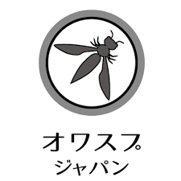

---

layout: col-sidebar
title: OWASP Japan
tags: japan
level: 0
region: Asia
country: Japan
meetup-group: japan-owasp-meetup-group

---

## OWASP Japanチャプターのホームページへようこそ。

OWASP - Open Worldwide Application Security Project とは、Webをはじめとするソフトウェアのセキュリティ環境の現状、またセキュアなソフトウェア開発を促進する技術・プロセスに関する情報共有と普及啓発を目的としたプロフェッショナルの集まる、オープンソース・ソフトウェアコミュニティです。The OWASP Foundationは、NPO団体として全世界のOWASPの活動を支えています。

OWASP Japanチャプターは、首都圏のみならず、国内全域における、チャプター設立支援や、特にチャプターのない地域での普及啓発など全国でのセキュリティ啓発活動を行なっています。また、全国でお使いになれる成果物、すなわち各種翻訳プロジェクトなど、グローバルのOWASPコミュニティと連携しています。成果物は、政府・行政機関、教育機関、企業・団体などで活用いただいています。OWASP Japanには、どの地域にお住まいの方もご参加いただけます。

## イベント
OWASP Japanチャプターが主催/共催/協力するイベントを記載しています。
主催イベントは、主にDoorkeeperの[「オワスプジャパン」ページ](https://owasp.doorkeeper.jp/)でお申し込みになれます。

### オワスプナイト 2025.03
* 2025-03-04 18:00オープン / 18:30スタート at サイボウズ(東京 日本橋)
* [OWASP Night 2025.03](https://owasp.doorkeeper.jp/events/182085)

### OWASP Japanに参加するには
* OWASPが主催・参画するイベントに参加。３ヶ月程度の頻度でOWASP Night/Dayや関連イベントを開催しています。
* SNS: twitter, facebookなどのSNSにもOWASP Japanアカウントがありますのでぜひからんでください。
* 翻訳/日本語編集[OWASPドキュメント日本語化作業Githubレポジトリ](https://github.com/owasp-ja) に参加。プルリクをお願いします。
* 裏方： コミュニティ運営、イベント運営ボランティア。宣伝活動を他のイベントで行うこともあります。
* わいわい： OWASP Slack、またOWASP Japan Slackへご参加いただいてお声がけくださればうれしいです。(招待しますのでメールアドレスをお教えください）
* スピーカー・出演者 募集（常時）：アプリケーション、システムのセキュリティ開発・運用にかかわる、経験、リサーチなどの話を共有するスピーチをしていただける方、短いスピーチでも歓迎です。モバイル、API、クラウド、開発運用、アジャイルでのセキュリティ実装なども歓迎です。 もしスピーカーになることにご関心のある方、イベント参加申し込み時に、あるいは個別にチャプターリーダーまでご提案をお知らせください。

#### OWASP Japan logo

## OWASP Foundation
OWASPの各Projectやチャプターの活動はリーダーを含めすべて無報酬のボランティアにより成り立っています。
これらはメンバーシップ会費やチャプターサポーターによるスポンサーなどのコントリビューションによって賄われています。

#### 会員制度 OWASP.org Membership
* [個人: 年間50ドル(グローバル)、あるいは500ドル(ライフタイム) ](https://owasp.glueup.com/organization/6727/memberships/)
  個人会員の特典

  * OWASPのミッションへの継続的な支援
  * カンファレンスおよびトレーニングの参加費の割引
  * OWASPの選挙での投票
  * owasp.orgのメールアドレスの無料提供
  * 助成金、賞、奨学金への優先的なアクセス
  * トレーニングの割引およびオファーへの優先的なアクセス
  * 割引価格でのパートナーイベントへの参加
  * OWASPの学習プラットフォームへのアクセス（OWASPプロジェクト、スポンサーおよびパートナーからの商業的なオファーを含むパートナーが提供する会員特典へのアクセス
  * その他多数
  * 入会にあたり、OWASP Japanチャプターを指定していただきますとこのチャプターの予算をサポートすることができます！

## Chapter Supporters
以下の企業は、チャプタースポンサーとしてOWASP Japan Chapterを支援していただいています。個人の皆様、法人の皆様ともに、オワスプジャパンを力強くサポートしてくださり、ありがとうございます。

| || | |
|----|----|----|----|
|||||
|  |  |

#### OWASP Japan Chapter ローカル・スポンサーシップ	
   * 1000ドルのご寄付/1ショット を受け付けています。
   * [OWASPへのDonation](https://owasp.org/donate/)で支払い、その後OWASP Foundation事務局に「OWASP Japan Chapterを支援したい」と伝えることで実現できます。
   * 自社のセミナールーム提供や一般の会場、また撮影スタジオやミートアップの飲食など費用を直接支払っていただくことによってVenueサポーターとなっていただくのも歓迎です。
